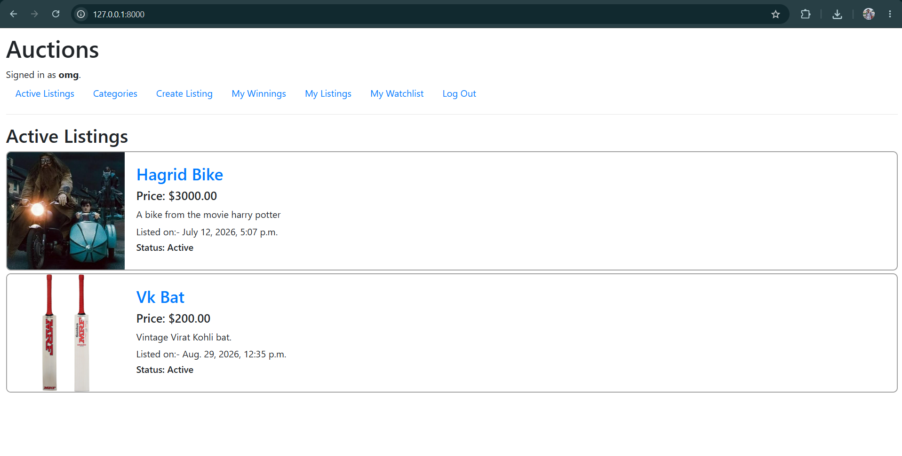
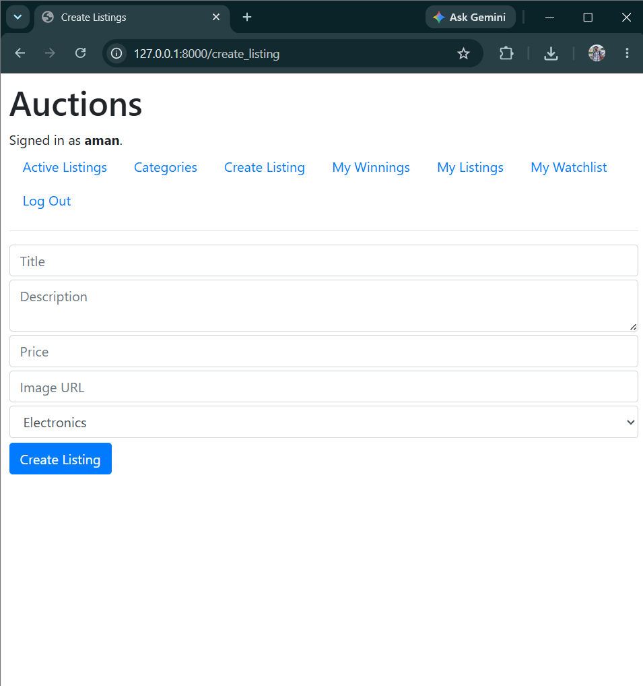
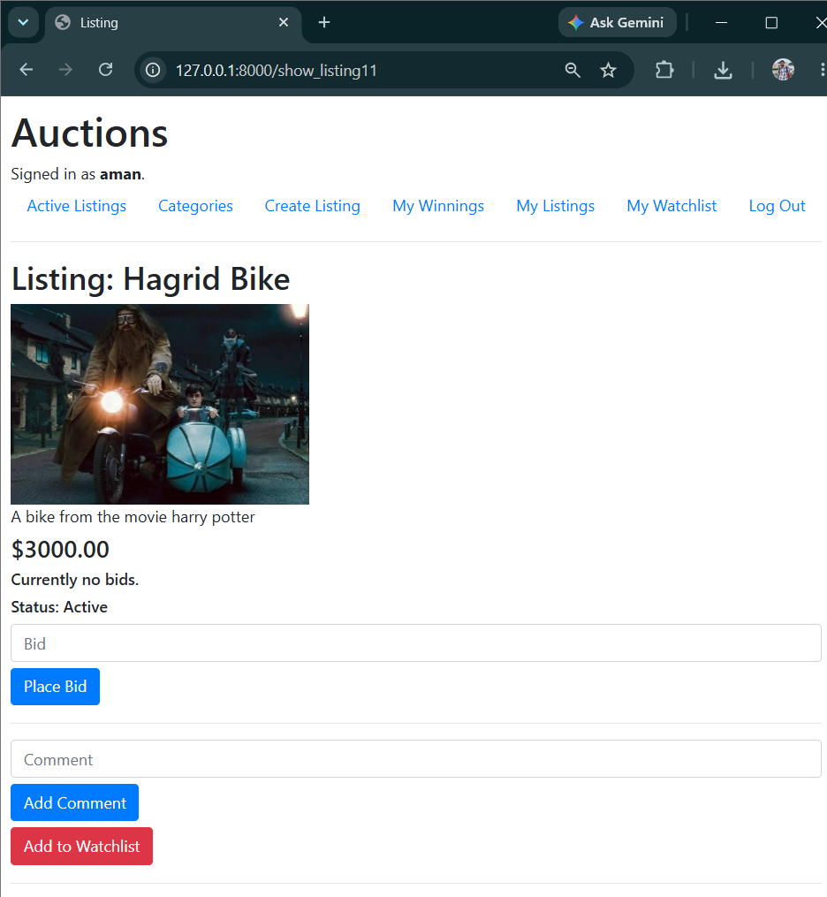
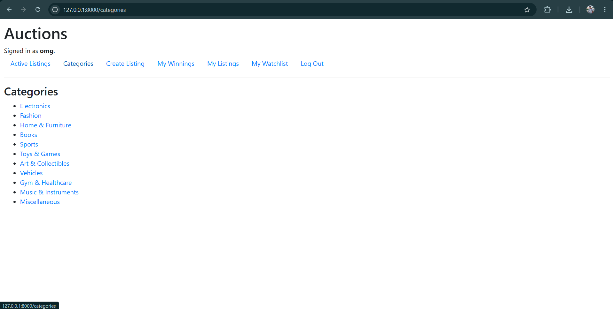
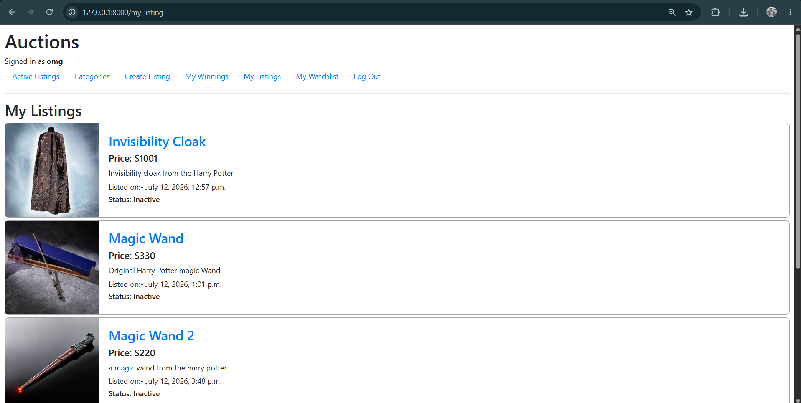
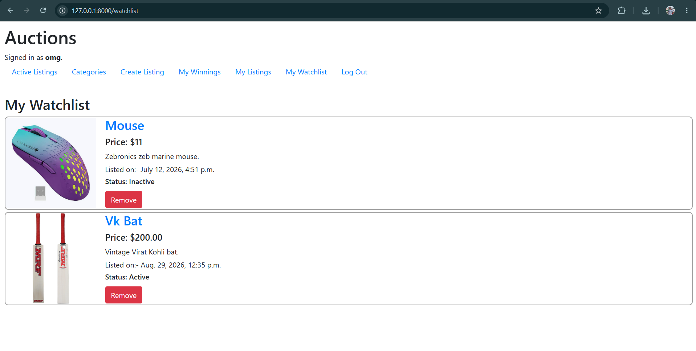
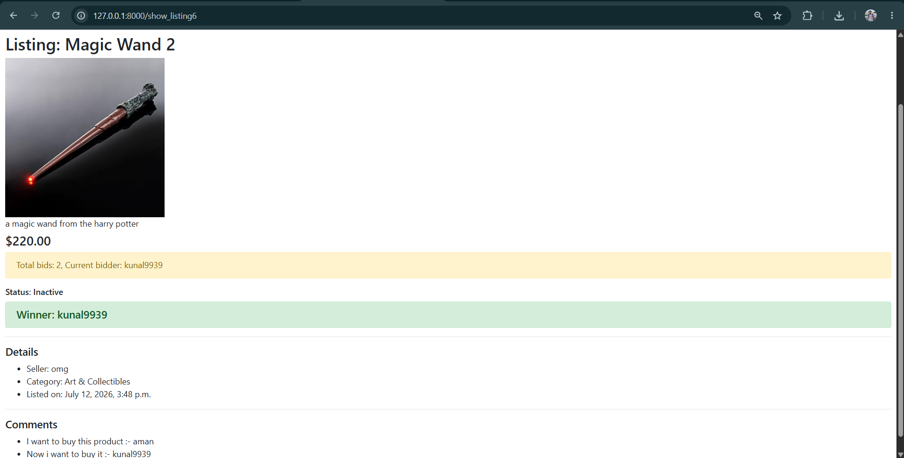
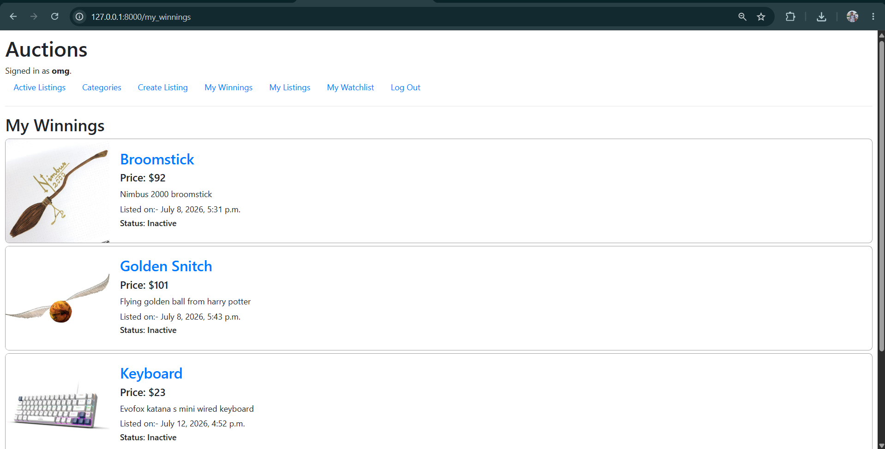

# Commerce

A full-stack online auction platform built with Django as part of Harvard's CS50W (Web Programming with Python and JavaScript) course.

Commerce allows users to create and manage auction listings, place bids, maintain watchlists, comment on listings, browse items by category, and close auctions with automatic winner selection.


## Demo

[▶️ Watch the Project Walkthrough on YouTube](https://www.youtube.com/watch?v=gNdUUs7p1b0)


## Features

- User registration and authentication
- Create and manage auction listings
- Place bids with validation
- Automatic winner selection when an auction is closed
- Add and remove listings from a personal watchlist
- Comment on auction listings
- Browse active listings by category
- View personal listings and auction winnings
- Responsive interface using Bootstrap
- Success and error notifications using Django Messages

## Screenshots

### Active Listings


### Create Listing


### View Listing


### Category


### My Listings


### Watchlist


### Closed Listing


### Winnings


## Built With

- Python
- Django
- HTML
- CSS
- Bootstrap
- SQLite

## Project Structure

```text
commerce/
├── auctions/
│   ├── migrations/
│   ├── templates/
│   ├── models.py
│   ├── views.py
│   └── urls.py
├── commerce/
│   ├── settings.py
│   ├── urls.py
│   └── ...
├── screenshots/
├── db.sqlite3
├── manage.py
├── README.md
└── requirements.txt